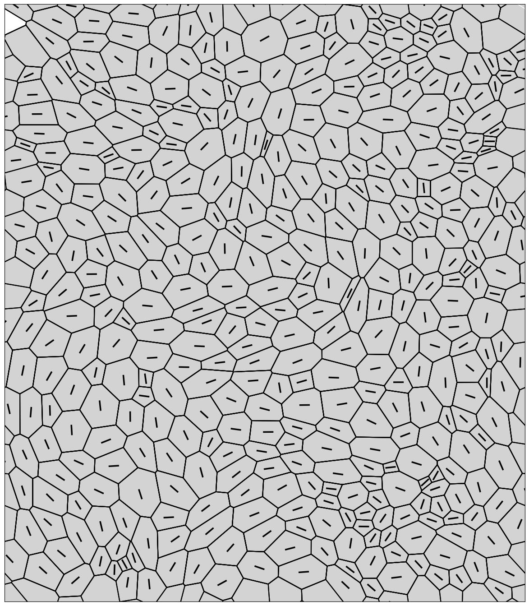

# Active Vertex Model with Mechanochemical Feedback

This repository contains the Active Vertex Model simulation framework, which couples tissue mechanics (vertex model) with mechanochemical signaling and cell division.

## Overview

The core simulation loop is driven by `MD_diff.py`, which models an epithelial tissue monolayer undergoing dynamics governed by physical forces, chemical signaling, active motility, and topological changes (T1 transitions and cell divisions). The model uses a periodic hexagonal lattice.

### Key Features

* **Vertex Model Physics**: Simulates cells as polygons where forces arise from area elasticity (incompressibility) and perimeter contractility (cortical tension / cell-cell adhesion).
* **Topological Transitions (T1)**: Handles local neighborhood exchanges when cell edges shrink below a defined threshold (`lmin`), ensuring tissue fluidity and rearrangement.
* **Cell Division**: Simulates oriented cell division based on geometric criteria (convexity, minimum area, nematic director) and mechanochemical states (cyclin thresholds).
* **Mechanochemical Coupling**:
  * Tracks molecular states (e.g., E, M, D, Cyclin, c) for each cell.
  * Updates chemistry based on cell-cell communication and mechanical stress (area differences).
* **Active Motility**: Simulates self-propelled active forces via a polarity vector for each cell, allowing cells to migrate within the tissue.
* **Periodic Boundaries**: Full support for periodic boundary conditions, enabling the simulation of bulk tissue behavior without edge effects.

## Usage

The simulation is executed via the `MD_diff.py` script.

```bash
python MD_diff.py <r> <Ahat> <cth> <seed> <output_dir>
```

### Arguments

* `<r>`: Cell division rate parameter scale factor (integer). Directly affects `rate_0`.
* `<Ahat>`: Target area threshold standard used in the mechanochemical update formulas (float).
* `<cth>`: Cyclin threshold required for a cell to be eligible for division (integer/float).
* `<seed>`: Random seed for reproducibility (integer).
* `<output_dir>`: Path to the directory where the simulation output sub-folder will be created.

### Example

```bash
python MD_diff.py 1 1.2 5 42 ./simulation_results
```

This will create a specific run directory inside `./simulation_results` named following the pattern: `r_1_cth_5_areahat_1.20_seed_42/`.

## Output Structure

The simulation generates files in the target run directory:

* **`parameters.txt`**: A log of all physical and chemical parameters used for that specific run.
* **`raw/`**: Directory containing `.npz` archives dumped every 100 simulation steps.
  * Contains: `vertices`, `polys` (object arrays), `edges`, `L` (box dims), and `forces`.
* **`vertices.txt`, `edges.txt`, `cell_indices.txt`, `L.txt`, `area.txt`**: Initial lattice generation configurations.
* **`time.txt`**: Total wall-clock time taken for the simulation.
* **`ncell.txt`**: Initial and final number of cells.

## Modifying Parameters

While some variables are passed through command-line arguments, many core physical constants are hardcoded in the `main()` function of `MD_diff.py`. You can modify these directly to explore different tissue fluidities or behaviors:

* `ka`: Area elastic modulus.
* `gamma`: Perimeter contractility coefficient.
* `q0`: Shape index parameter ($P_0 / \sqrt{A_0}$). Values > ~3.81 imply a fluid-like tissue, while values < 3.81 imply a solid-like (jammed) tissue.
* `zeta`: Cell friction/drag coefficient.
* `xi`: Active motility force magnitude.
* `total_time`: Duration of the simulation.

## Core Modules

* **`MD_diff.py`**: The main execution script and molecular dynamics integration loop.
* **`force.py`**: Computes the gradient of the energy to apply forces to vertices.
* **`transition.py`**: Handles topological T1 transitions, generalized node-switching for overlap control, and oriented cell division.
* **`energy.py`**: Computes the Hamiltonian (elastic and contractile energy).
* **`mechanochemical_stable.py`**: Contains the ODE integration for the chemical signaling network.
* **`motility.py`**: Updates cell polarity vectors.
* **`Polygon.py`**: The `Polygon` class representing individual cells mathematically.
* **`geometry.py`**: Core mathematical functions for periodic distances, areas, intersections, and nematic tensors.
* **`nematic.py`**: Handles nematic tensor and shared edge calculations.
* **`parameters.py`**: Centralized parameter definitions and initializations.
* **`parser.py`**: File parsing utilities for geometry, vertices, and edges.
* **`periodic_hex_lattice_diff.py`, `grid.py`, `trace_periodic.py`**: Grid generation logic for creating the initial periodic hexagonal lattice.
* **`tissue_plot.py`**: Plot the vertex model tissue.

## Simulation Snapshot



## Publications

This code or variations of this code have been used for simulations in the following papers:

- Amrapali Datta, Phanindra Dewan, Aswin Anto, Tanya Chhabra, Tanishq Tejaswi, Sindhu Muthukrishnan, Akshar Rao, Sumantra Sarkar, Medhavi Vishwakarma. _Differential interfacial tension between oncogenic and wild-type populations forms the mechanical basis of tissue-specific oncogenesis in epithelia_. eLife14:RP106893 (2025). <https://doi.org/10.7554/eLife.106893.3>.
- Sindhu Muthukrishnan, Phanindra Dewan, Tanishq Tejaswi, Michelle B. Sebastian, Tanya Chhabra, Soumyadeep Mondal, Soumitra Kolya, Sumantra Sarkar, and Medhavi Vishwakarma. _Glassy dynamics in active epithelia emerge from an interplay of mechanochemical feedback and crowding_. bioRxiv (2025): 2025-11. <https://doi.org/10.1101/2025.11.08.687351>.
